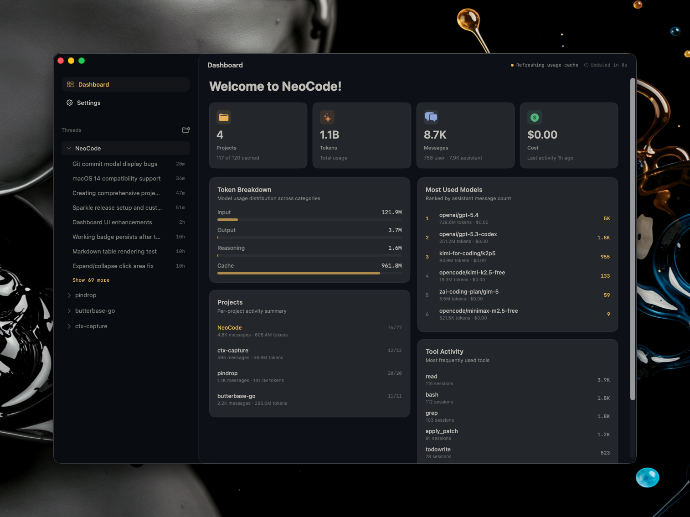

# NeoCode

[](https://developer.apple.com/macos/)
[](https://swift.org/)
[](https://developer.apple.com/documentation/swiftui)
[](LICENSE)

> A native macOS SwiftUI client for OpenCode — the AI-powered coding assistant that runs locally in your projects.



NeoCode provides a beautiful, native macOS interface for OpenCode, launching per-project runtimes and connecting over HTTP/SSE to deliver AI-powered coding assistance with real-time streaming responses, tool execution, and seamless Git integration.

## Table of Contents

- [Background](#background)
- [Install](#install)
- [Usage](#usage)
- [Features](#features)
- [Architecture](#architecture)
- [Development](#development)
- [Building](#building)
- [Contributing](#contributing)
- [License](#license)

## Background

NeoCode was built to provide a first-class macOS experience for OpenCode users. While OpenCode excels as a terminal-based AI coding assistant, NeoCode brings that power into a modern, native SwiftUI application with:

- **Native macOS Interface**: Built with SwiftUI and designed for macOS 26.1+
- **Real-time Streaming**: Server-Sent Events (SSE) for live AI responses
- **Per-Project Runtimes**: Isolated OpenCode instances for each project
- **Deep Git Integration**: Branch management, commit workflows, and repository actions
- **Markdown Rendering**: Rich conversation display with syntax-highlighted code blocks
- **Auto-updates**: Built-in Sparkle integration for seamless updates

## Install

### Requirements

- macOS 26.1 or later
- OpenCode CLI installed (`opencode` command available in PATH)
- Xcode 16+ (for building from source)

### Download

Download the latest release from the [Releases](https://github.com/watzon/NeoCode/releases) page.

### Install via Homebrew (Coming Soon)

```bash
brew install --cask neocode
```

### Build from Source

```bash
git clone https://github.com/watzon/NeoCode.git
cd NeoCode
just build
```

## Usage

1. **Launch NeoCode** — The app will automatically detect OpenCode in your PATH
2. **Add a Project** — Click "+" in the sidebar to add a project folder
3. **Start a Session** — Select a project and create a new conversation
4. **Chat with AI** — Use the composer to ask questions, request code changes, or execute commands
5. **Review Changes** — NeoCode displays diffs, tool outputs, and file modifications in real-time

### Keyboard Shortcuts

| Shortcut | Action |
|----------|--------|
| `⌘N` | New Session |
| `⌘⇧N` | New Project |
| `⌘W` | Close Current Session |
| `⌘,` | Open Settings |
| `⌘R` | Refresh Runtime Connection |
| `⌘⌫` | Clear Conversation |

## Features

### Core

- **🚀 Per-Project Runtimes**: Each project gets its own isolated OpenCode instance
- **⚡ Real-time Streaming**: Live AI responses via Server-Sent Events
- **📝 Rich Markdown**: Syntax-highlighted code blocks, tables, and formatting
- **🔧 Tool Execution**: View and approve tool calls with detailed output
- **❓ Interactive Questions**: Handle permission requests and multiple-choice prompts

### Git Integration

- **Branch Management**: Create, switch, and delete branches from the UI
- **Commit Workflow**: Stage changes, write commits, and push directly
- **Status Display**: Visual indicators for modified, staged, and untracked files

### Workspace Tools

- **Editor Integration**: Open files in VS Code, Xcode, or your preferred editor
- **File Manager**: Reveal files in Finder with a single click
- **Project Discovery**: Automatic detection of common project structures

### Developer Experience

- **Dark & Light Themes**: Choose your preferred appearance
- **Syntax Highlighting**: Code blocks rendered with language detection
- **Error Handling**: User-friendly error messages with detailed logging
- **Auto-updates**: Sparkle-powered automatic updates

## Architecture

NeoCode follows a clean, modular architecture with clear separation of concerns:

```
NeoCode/
├── AppShell/              # SwiftUI views for UI components
│   ├── ComposerViews.swift
│   ├── ConversationViews.swift
│   ├── SidebarViews.swift
│   ├── TranscriptViews.swift
│   └── MarkdownViews.swift
├── OpenCode/              # HTTP client and transport layer
│   ├── OpenCodeClient.swift
│   ├── OpenCodeEventDecoder.swift
│   ├── OpenCodeModels.swift
│   └── OpenCodeSSE.swift
├── Models/                # App-side domain models
├── Persistence/           # UserDefaults and caching
├── Git Services/          # Git integration
└── Theme/                 # Design system tokens
```

### Key Components

| Component | Responsibility |
|-----------|---------------|
| `AppStore` | Main state container, session orchestration, persistence |
| `OpenCodeRuntime` | Process management, health checks, runtime lifecycle |
| `OpenCodeClient` | HTTP transport, request building, SSE handling |
| `GitBranchService` | Git branch operations and management |
| `WorkspaceToolService` | External editor and file manager discovery |

### State Management

NeoCode uses SwiftUI's **Observation** framework with `@Observable` reference types:

- `AppStore` — Application state, projects, sessions
- `OpenCodeRuntime` — Runtime connection and health
- Environment injection via `@Environment`

All state containers are `@MainActor` isolated for thread safety.

## Development

### Prerequisites

- macOS 26.1 or later
- Xcode 16 or later
- Swift 5.0+
- `just` command runner (`brew install just`)

### Setup

```bash
# Clone the repository
git clone https://github.com/watzon/NeoCode.git
cd NeoCode

# Verify tools
just check-tools
```

### Running Tests

```bash
# Run all tests
just test

# Run unit tests only
xcodebuild test -project "NeoCode.xcodeproj" -scheme "NeoCode" -destination 'platform=macOS' -only-testing:NeoCodeTests

# Run UI tests only
xcodebuild test -project "NeoCode.xcodeproj" -scheme "NeoCode" -destination 'platform=macOS' -only-testing:NeoCodeUITests
```

### Project Structure

- **Unit Tests**: `NeoCodeTests/` — Swift Testing framework
- **UI Tests**: `NeoCodeUITests/` — XCTest for smoke tests
- **Scripts**: `scripts/` — Build and release automation
- **Documentation**: `BUILD.md`, `RELEASING.md`

## Building

### Debug Build

```bash
just build
```

### Release Build

```bash
just build-release
```

### Create DMG

```bash
just dmg
```

Output: `dist/NeoCode.dmg`

### Full Release

```bash
just release X.Y.Z
```

See [BUILD.md](BUILD.md) and [RELEASING.md](RELEASING.md) for detailed release instructions.

### Build Commands

| Command | Description |
|---------|-------------|
| `just build` | Debug build |
| `just build-release` | Release build |
| `just test` | Run test suite |
| `just archive` | Create signed archive |
| `just dmg` | Build signed DMG |
| `just notarize <dmg>` | Notarize DMG |
| `just release <version>` | Full release workflow |

## Contributing

Contributions are welcome! Please read our [Contributing Guide](CONTRIBUTING.md) for details on:

- Code style and conventions
- Testing requirements
- Pull request process
- Reporting issues

### Quick Start for Contributors

1. Fork the repository
2. Create a feature branch (`git checkout -b feature/amazing-feature`)
3. Make your changes
4. Run tests (`just test`)
5. Commit your changes (`git commit -m 'Add amazing feature'`)
6. Push to the branch (`git push origin feature/amazing-feature`)
7. Open a Pull Request

### Code Conventions

- **Swift Version**: 5.0 with approachable concurrency enabled
- **Architecture**: MVVM with Observation framework
- **Threading**: MainActor-isolated observable state
- **Naming**: UpperCamelCase for types, lowerCamelCase for members
- **Error Handling**: Prefer early `guard` exits, typed `LocalizedError` enums

## License

[MIT](LICENSE) © Chris Watson

---

**NeoCode** is not affiliated with OpenCode. It is an independent macOS client built by the community, for the community.
